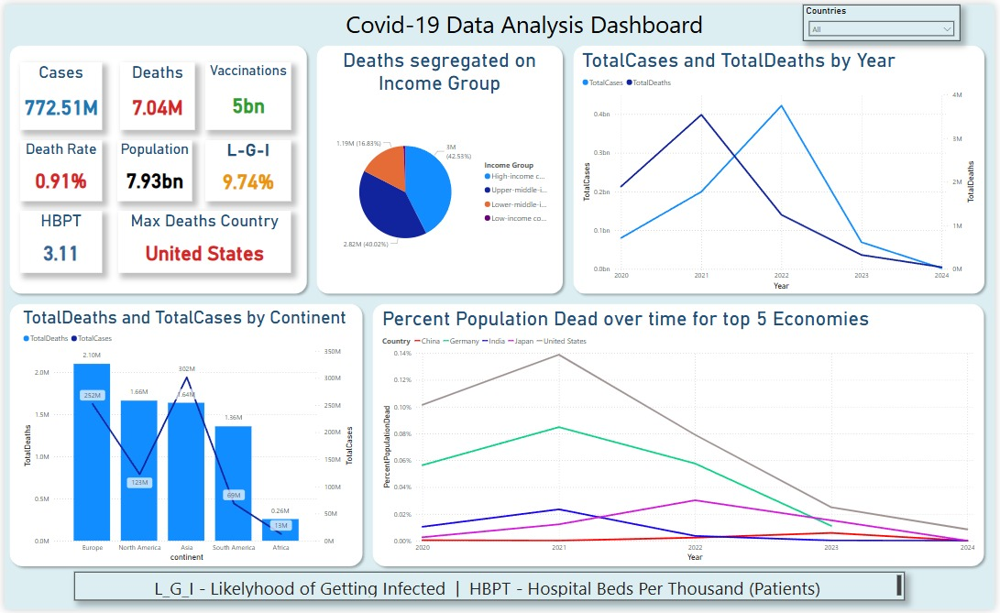

# Covid-19 Data Analysis Project (Power BI + SQL)

## Problem Statement

An analysis of countries conditions during COVID-19 and how they dealt with it. The goal was to use both SQL and Power BI to create a unified analytical solution that provides dynamic insights into infection rates, death rates, healthcare infrastructure, and socio-economic disparities.

## Data Sources

* **Covid Deaths & Vaccinations**: Our World In Data (OWID)
https://github.com/owid/covid-19-data/blob/master/public/data/owid-covid-data.csv

The above is a open COVID-19 dataset which I divided into 2 parts - CovidDeaths and CovidVaccinations

---

##Dashboard Snapshot



## SQL Workflow: Data Cleaning & Preparation

### Step 1: Loaded raw EXCEL files into SQL Server using SSMS

* covid\_deaths.xlxs
* covid\_vaccinations.xlxs

### Step 2: Data Cleaning in SQL

* Checked column data types and corrected where necessary
* Replaced NULLs with 0s for numeric columns like `new_cases`, `new_deaths`


### Step 3: Created KPIs using SQL Views like-

```sql
CREATE VIEW TotalCases AS
SELECT location, SUM(new_cases) AS TotalCases
FROM CovidDeaths
WHERE location IN (SELECT Country FROM RealCountries)
GROUP BY location;

CREATE VIEW TotalDeaths AS
SELECT location, SUM(new_deaths) AS TotalDeaths
FROM CovidDeaths
WHERE location IN (SELECT Country FROM RealCountries)
GROUP BY location;
```


## Power BI Dashboard: Visual Analytics

### Step 1: Data Import

* Imported cleaned SQL tables and views into Power BI
* Related tables using common keys (`location`, `date`)

### Step 2: DAX Measures for KPIs like-

```DAX
TotalCases = CALCULATE(SUM(CovidDeaths[new_cases]), TREATAS(VALUES(RealCountries[Country]), CovidDeaths[location]))

TotalDeaths = CALCULATE(SUM(CovidDeaths[new_deaths]), TREATAS(VALUES(RealCountries[Country]), CovidDeaths[location]))

DeathRate = DIVIDE([TotalDeaths], [TotalCases])

Population = MAX(CovidDeaths[population])

L_G_I = DIVIDE([TotalCases], [Population])

HBPT = AVERAGE(CovidMetadata[hospital_beds_per_thousand])

MaxDeathsCountry = CALCULATE(MAX(CovidDeaths[location]), TOPN(1, SUMMARIZE(CovidDeaths, CovidDeaths[location], "Deaths", SUM(CovidDeaths[new_deaths])), [Deaths], DESC))
```

### Step 3: Visualizations Created

1. **Dynamic KPIs**

   * Total Cases, Deaths, Vaccinations, Death Rate, Population, L\_G\_I (Likelihood of Getting Infected), HBPT (Hospital Beds/Thousand), Max Deaths Country

2. **Pie Chart**

   * Deaths Segregated by Income Group

3. **Line Charts**

   * Total Cases and Deaths Over Time
   * Percent Population Dead Over Time for Top 5 Economies

4. **Bar Chart**

   * Total Cases & Deaths by Continent

5. **Slicers**

   * Location Filter (affects selected charts only)

6. **Footer**

   * With explanation of terms (L\_G\_I, HBPT)

---

## Insights from Dashboard

### KPIs (Dynamic by Country)

* **Total Cases**: 772.5M
* **Total Deaths**: 7.04M
* **Vaccinations**: 5Bn
* **Death Rate**: 0.91%
* **L\_G\_I**: 9.74% (worldwide average)
* **HBPT**: 3.11 (worldwide avg)
* **Max Deaths Country**: United States

### Visual Trends

* **Total Cases vs Deaths by Year**: Sharp peak in 2021–22
* **By Continent**: Europe and Asia had the highest death tolls
* **By Income Group**: High and upper-middle-income countries faced the brunt of total deaths
* The last two trends could lead to a speculation that proper accounting of cases and deaths relating to COVID-19 might not have been done properly in groups with poor financial situations, which could be used to explain as to why total deaths and total cases in Africa are so low.
* **Top 5 Economies**: USA consistently showed highest % population dead and infected which shows their unpreparedness; India showed steep drops post 2021

---
